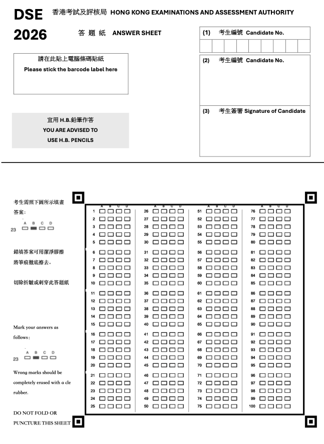

# DSE OMR Scanner

A web-based OMR tool for generating, printing, and scanning DSE-style multiple-choice answer sheets.

在線試用：<https://omr.cpuloyalty.cc/>



## Overview

DSE OMR Scanner 是一個面向選擇題場景的答題卡工具，提供從 **答題卡生成**、**拍照掃描** 到 **答案識別與結果整理** 的完整流程。

項目基於前端技術棧實現，可本地運行，也可自行部署為線上工具，適合用於 DSE、模擬考、小型測驗，以及 OMR 流程驗證等場景。

## Features

- **Answer sheet generation**：生成可直接打印的答題卡 PDF
- **OMR recognition**：基於 OpenCV.js 進行拍照掃描與選項識別
- **Perspective correction**：自動校正紙張透視與定位區域
- **Result review**：掃描後可檢查、修正與確認識別結果
- **Task workflow**：支持題目數、答案設定與任務管理
- **Self-hostable**：可本地開發，也可部署到靜態網站平台

## Recommended PDF Template

除了在網頁內直接生成 PDF 外，**更推薦直接使用項目內附的現成模板打印**：

[`MC-scanner pdf-20260211.chito(1).pdf`](./MC-scanner%20pdf-20260211.chito(1).pdf)

> 相比網頁即時生成的版本，這個 PDF 的打印效果通常更穩定，掃描識別表現也更好。

## Usage

### 1. Prepare the answer sheet

你可以選擇：
- 在網站內直接生成答題卡 PDF
- 或使用項目附帶的推薦 PDF 模板打印

### 2. Fill in the sheet

為了獲得更穩定的識別結果，建議：
- 使用 **H.B. 鉛筆** 填塗
- 保持填塗清晰、完整
- 避免折疊、污漬或過度陰影

### 3. Scan the answer sheet

上傳照片或直接使用手機拍照後，系統會自動：
- 檢測定位標記
- 進行透視校正
- 識別答題區選項
- 輸出答案與預覽結果

## Scanning Tips

為了提升識別成功率，拍攝時請盡量確保：

- 四個角標完整入鏡
- 光線充足且均勻
- 紙張平整
- 背景與紙張有足夠對比
- 相片清晰，避免模糊與過度傾斜

## Local Development

### Install dependencies

```bash
npm install
```

### Start development server

```bash
npm run dev
```

### Build for production

```bash
npm run build
```

### Preview production build

```bash
npm run preview
```

## Tech Stack

- React
- TypeScript
- Vite
- OpenCV.js
- jsPDF
- Zustand
- Sass

## Project Structure

```text
src/
├── components/      # Reusable UI components
├── pages/           # Scanner, results, settings, tasks
├── services/        # OMR, OpenCV, and PDF logic
├── store/           # State management
└── styles/          # Global styles
```

## Use Cases

- DSE / 模擬考答題卡製作
- 小型測驗快速閱卷
- OMR 掃描流程原型與驗證
- 自行部署的答題卡識別工具

## Notes

- 識別效果會受打印精度、光線、拍攝角度與紙張平整度影響
- 若掃描失敗，請優先檢查四角定位標記是否清晰完整
- 若需要較穩定的打印品質，建議優先使用項目附帶的 PDF 模板

## License

MIT
